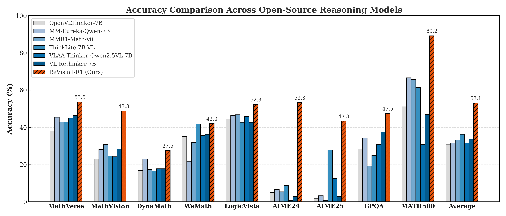

<div align="center">
  <h1 style="margin: 0; font-size: 1.8em;">
    
    Advancing Multimodal Reasoning: From Optimized Cold Start to Staged Reinforcement Learning
  </h1>
</div>


## 📚 Overview


- [⚡ News](#-news)
- [🚧 TODO](#-todo)
- [📖 Introduction](#-introduction)
- [🍭 Results](#-results)
- [🏝️ Reasoning Example](#-reasoning-example)
- [✨ Getting Started](#-getting-started)
- [🎁 Evaluation](#-evaluation)
- [🖥️ Inference](#-inference)


## ⚡ News

- [2025/06/02] 🔥 Revisual-R1 paper available on arxiv.

## 🚧 TODO

We are preparing to complete these tasks over the next few weeks, please stay tuned!

- 🚧 We are going to release the training datasets(Coldstart, MRL, TRL).
- 🚧 We are going to release the checkpoint.
- 🚧 We are in the process of training for 32B & 3B Revisual-R1 and will release them when we finish.

## 📖 Introduction

This paper introduces **ReVisual-R1**, a 7B open-source MLLM designed to address prevalent challenges in cultivating sophisticated multimodal reasoning. 
By systematically integrating a strategic, high-difficulty text-only cold-start phase for foundational reasoning, a Multimodal RL stage employing GRPO stabilized by our novel **Prioritized Advantage Distillation (PAD)** mechanism and guided by rule-based rewards including an Efficient-Length Reward, and a final TextRL refinement phase, our structured three-stage curriculum demonstrates that thoughtful data strategy and targeted algorithmic optimizations are pivotal. ReVisual-R1 achieves **SOTA** performance among open-source 7B models on a suite of challenging visuo-mathematical and reasoning benchmarks. 
This work underscores that careful curriculum design and algorithmic enhancements, rather than sheer model scale, can unlock robust, self-reflective multimodal reasoning. 

### 🔑 Key Features


1. **Cold-Start Insights:** We reveal that existing multimodal cold-start corpora lack sufficient difficulty and show that a high-complexity, text-centric warm-up is critical for fostering advanced visual reasoning.

2. **Stable RL Optimisation:** We introduce *Prioritised Advantage Distillation* (PAD) to overcome gradient stagnation, enabling stable and sample-efficient reinforcement learning for MLLMs.

3. **Staged Curriculum & Model:** We design a three-phase training pipeline—text warm-up, multimodal RL with PAD, and text RL—culminating in *ReVisual-R1*, the first open-source 7 B model with self-critical, multi-hop reasoning that rivals proprietary systems.


## 🍭 Results



**ReVisual-R1** presents strong performance in challenging visual-mathematical reasoning tasks, while simultaneously preserving strong general-purpose text skills. 

## 🏝️ Reasoning Example

### Previous Reasoning Models

Previous open-source multimodal reasoning model reasoning case.


### Revisual-R1

Our **Revisual-R1** model reasoning case, showcasing its exceptional reasoning ability. The model generates long responses, continuously hypothesizing, reflecting, verifying, and correcting to arrive at the final answer, while also providing a summary answer.


## ✨ Getting Started

### 🔧 Installing

You can install Revisual-R1 dependencies by running the following commands:
```bash
conda create -n revisual python=3.11 -y && conda activate revisual

cd Revisual-R1
pip3 install -e .
```


If you encounter issues when installing flash-attn, we recommend you to install it here 
[flash-attn](https://github.com/Dao-AILab/flash-attention/releases/tag/v2.7.3). For example, we use this version. 
```bash
$ wget https://github.com/Dao-AILab/flash-attention/releases/download/v2.7.3/flash_attn-2.7.3+cu12torch2.4cxx11abiFALSE-cp310-cp310-linux_x86_64.whl
$ pip install flash_attn-2.7.3+cu12torch2.4cxx11abiFALSE-cp310-cp310-linux_x86_64.whl
```

### 🔧 Training

#### Cold Start Training 
```bash
bash ./cold_start/run_cold_start.sh
```

#### Staged Reinforcement Optimization 
```bash
bash ./examples/main.sh
```
If you encounter issues with connecting to Hugging Face, consider using export HF_ENDPOINT=https://hf-mirror.com.


### 🔧 Merge Checkpoint in Hugging Face Format
```bash
python3 scripts/model_merger.py --local_dir checkpoints/${ProjectName}$/exp_name/global_step_100/actor
```

## 🎁 Evaluation

### 🤖 Usage

```plain
usage: main.py [-h] --model-name MODEL_NAME --openai-api-key OPENAI_API_KEY [--openai-base-url OPENAI_BASE_URL] [--cache-dir CACHE_DIR] [--output-dir OUTPUT_DIR] [--max-tokens MAX_TOKENS] [--min-pixels MIN_PIXELS]
               [--max-pixels MAX_PIXELS] [--temperature TEMPERATURE] [--top-p TOP_P] [--system-prompt SYSTEM_PROMPT] [--datasets DATASETS] [--dataset-dir DATASET_DIR] [--eval-threads EVAL_THREADS] [--max-retries MAX_RETRIES]

Unified evaluation for multimodal math datasets

options:
  -h, --help            show this help message and exit
  --model-name MODEL_NAME
                        The name of the model to use
  --openai-api-key OPENAI_API_KEY
                        The API key for the OpenAI API
  --openai-base-url OPENAI_BASE_URL
                        The base URL for the OpenAI API
  --cache-dir CACHE_DIR
                        Directory to cache predictions
  --output-dir OUTPUT_DIR
                        Directory to save results
  --max-tokens MAX_TOKENS
                        Maximum number of tokens to generate
  --min-pixels MIN_PIXELS
  --max-pixels MAX_PIXELS
  --temperature TEMPERATURE
                        Sampling temperature
  --top-p TOP_P         Top-p sampling
  --system-prompt SYSTEM_PROMPT
                        System prompt for the model
  --datasets DATASETS   Comma-separated list of datasets to evaluate: geo3k,wemath,mathvista,mathverse,mathvision or 'all'
  --dataset-dir DATASET_DIR
  --eval-threads EVAL_THREADS
                        Number of threads for evaluation
  --max-retries MAX_RETRIES
                        Maximum number of retries for evaluation
```

### 🔓Examples

**(1)** Evaluate a model directly via OpenAI API

```shell
python ./src/main.py --model-name="gpt-4.1" \
	--openai-api-key="YOUR_API_KEY" \
	--cache-dir="./cache"
```

**(2)** Deploy and evaluate a local model using [lmdeploy](https://github.com/InternLM/lmdeploy)

```shell
lmdeploy serve api_server \
	/path/to/local/lmm \
	--model-name lmm_name \
	--server-port 23333 \
	--chat-template qwen2d5-vl

python ./src/main.py --model-name="lmm_name" \
	--openai-base-url="http://localhost:23333/v1" \
	--openai-api-key="YOUR_API_KEY" \
	--cache-dir="./cache"
```

## 🖥️ Inference

Run the command below.
```bash
MODEL_PATH="Reviusal-R1"
MAX_TOKENS=16384
DO_SAMPLE=True
TEMPERATURE=1.0
TOP_P=0.95
TOP_K=50
NUM_RETURN_SEQUENCES=1


prompt = "You FIRST think about the reasoning process as an internal monologue and then provide the final answer. The reasoning process MUST BE enclosed within <think> </think> tags. The final answer MUST BE put in \\boxed{}."
question="xxx"


python infer.py \
 --model_path ${MODEL_PATH} \
 --image_path ${IMAGE_PATH} \
 --question ${question} \
 --prompt ${prompt} \
 --max_tokens ${MAX_TOKENS} \
 --do_sample ${DO_SAMPLE} \
 --temperature ${TEMPERATURE} \
 --top_p ${TOP_P} \
 --top_k ${TOP_K} \
 --num_return_sequences ${NUM_RETURN_SEQUENCES} 
```
You can also modify the arguments in `inference/inference.sh`
```shell
bash inference/inference.sh
```

